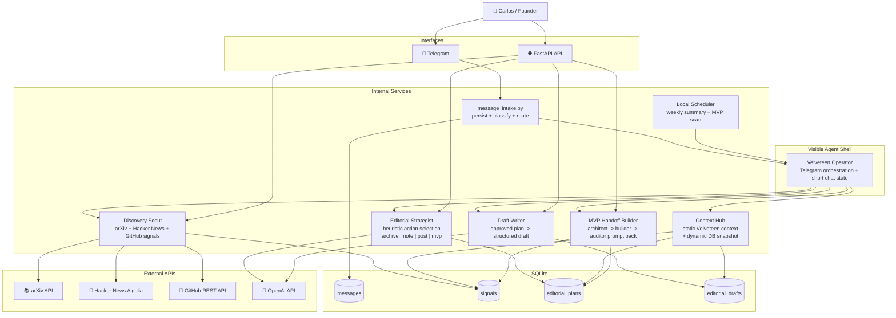

# Velveteen Insight Engine

Velveteen Insight Engine is the operating system for turning signals, research, repository activity, and technical observations into usable editorial and portfolio work inside **The Velveteen Project**.

This is not a generic content bot. It is a **Telegram-first agent shell** over a persisted workflow:

`signal -> plan -> human approval -> draft -> optional MVP handoff`

## What It Is

**The Velveteen Project** is a founder-led applied decision systems lab.

Its direction is:

- rigorous ideas
- mathematical modeling
- machine learning and NLP
- agentic workflows
- software that is actually useful
- real deployment over demo theater
- clarity over hype

Velveteen Insight Engine exists to help Carlos move from:

- papers
- news and technical signals
- GitHub repository activity
- voice notes
- ideas and observations

into:

- persisted signals
- editorial plans
- human review
- drafts
- and, when evidence is strong enough, small MVP build directions

## What It Is Not

- not a generic AI automation agency backend
- not a “post generator”
- not a fake multi-agent demo
- not a system where the LLM owns the logic
- not a publishing engine yet

## Product Shape Today

The project now has a clear split:

- **one visible agent shell**
  - `Velveteen Operator`
  - this is the Telegram-facing layer
- **a set of internal specialist services**
  - discovery
  - GitHub insight extraction
  - editorial planning
  - draft generation
  - conservative MVP handoff preparation

That means the system is no longer just “a bot with slash commands”. The visible goal is an operator that can search, suggest, summarize, and move work forward inside the chat while still relying on persisted state and deterministic rules.

## Agent Model

### 1. Velveteen Operator

The only agent the founder should really feel in Telegram.

Responsibilities:

- interpret Telegram text or slash commands
- keep short-lived chat context
- route to the right internal service
- suggest the next reasonable step
- keep responses compact and sober

### 2. Discovery Scout

Mostly deterministic.

Responsibilities:

- fetch signals from arXiv and Hacker News
- fetch portfolio signals from priority GitHub repos
- rank and persist useful signals

### 3. Editorial Strategist

Hybrid but conservative.

Responsibilities:

- take persisted signals
- decide `archive | note | post | mvp` with auditable rules
- generate a structured editorial proposal
- persist `editorial_plans`

### 4. Draft Writer

Scoped generation only.

Responsibilities:

- take an approved plan
- generate a structured draft
- keep the same output contract with or without the LLM
- persist `editorial_drafts`

### 5. MVP Handoff Builder

Conservative and explicit.

Responsibilities:

- take a plan already classified as `mvp`
- produce a structured handoff pack for:
  - a prompt architect
  - a coding model
  - an auditor model
- keep scope narrow and testable

It does **not** auto-build the MVP yet. It prepares the next serious step.

## Context Kernel

To avoid hallucinated identity drift, the engine now uses a lightweight context hub instead of pretending memory exists everywhere.

### Static context

Checked into the repo:

- [`app/context/velveteen_linkedin_github.md`](app/context/velveteen_linkedin_github.md)

It encodes:

- The Velveteen Project identity
- Carlos as founder/operator
- anti-hype rules
- output style for chat, LinkedIn, and GitHub-adjacent work

### Dynamic context

Built from SQLite snapshots:

- recent `signals`
- recent `editorial_plans`
- recent `editorial_drafts`

This is intentionally small. It is **retrieval, not a vector database**.

## Current Phases

- **Phase 1**: FastAPI app, Telegram webhook, SQLite persistence
- **Phase 2**: Telegram parsing, reply and URL detection, deterministic classifier
- **Phase 3**: Voice note intake and non-fatal transcription
- **Phase 4**: External discovery with arXiv and Hacker News
- **Phase 5**: GitHub insight service for public repos
- **Phase 6**: Structured editorial planning from persisted signals
- **Phase 7**: Editorial plan persistence and human approval workflow
- **Phase 8**: Draft generation from approved plans
- **Phase 9**: Telegram command layer and small local scheduler
- **Phase 10**: Velveteen Operator layer, shared context kernel, MVP handoff preparation

## System Flow



## Current Telegram UX

The Telegram layer supports both explicit slash commands and a small amount of natural-language routing.

Examples that work today:

- `help`
- `/help`
- `signals climate risk`
- `/signals climate risk`
- `hazme un plan del primero`
- `/plan 12`
- `apruébalo`
- `/approve 5`
- `draft`
- `/draft 5`
- `show_plan 5`
- `show_draft 2`
- `mvp_handoff 5`

The important part is that Telegram does **not** bypass the persisted workflow. It is a shell over it.

## Main Working Loops

### Editorial loop

1. discover signals
2. choose one useful signal
3. create a persisted editorial plan
4. review and approve it
5. generate a persisted draft
6. inspect the result in Telegram or by API

### MVP loop

1. discover signals
2. plan recommends `mvp`
3. approve the plan
4. request an MVP handoff pack
5. use that pack with a separate builder / auditor workflow

## Data Model

- `messages`
  - normalized Telegram intake
- `signals`
  - external or internal signals
- `editorial_plans`
  - structured editorial proposals
  - statuses:
    - `draft`
    - `approved`
    - `saved`
    - `discarded`
- `editorial_drafts`
  - structured drafts born from approved plans
  - statuses:
    - `draft`
    - `discarded`

## Main API Endpoints

### Health

- `GET /api/v1/health`

### Telegram

- `POST /api/v1/telegram/webhook`

### Discovery

- `GET /api/v1/discovery/suggest`

This endpoint is stateful: it discovers, ranks, persists signals, and then responds.

### GitHub insights

- `GET /api/v1/github/insights/suggest`

This endpoint is also stateful: it suggests insights and persists them to `signals`.

### Editorial plans

- `POST /api/v1/editorial/plan`
- `GET /api/v1/editorial/plans/{id}`
- `POST /api/v1/editorial/plans/{id}/approve`
- `POST /api/v1/editorial/plans/{id}/save`
- `POST /api/v1/editorial/plans/{id}/discard`

### Drafts

- `POST /api/v1/editorial/plans/{id}/draft`
- `GET /api/v1/editorial/drafts/{id}`
- `POST /api/v1/editorial/drafts/{id}/discard`

### MVP handoff

- `GET /api/v1/editorial/plans/{id}/mvp-handoff`

This route returns a structured handoff pack only when the persisted plan has `recommended_action = mvp`.

## Project Structure

```text
app/
├── api/routes/        # FastAPI endpoints
├── context/           # Static Velveteen / LinkedIn / GitHub context
├── core/              # Config and brand voice
├── db/                # SQLite setup and queries
├── domain/            # Internal domain models
├── integrations/      # Telegram, GitHub, arXiv, HN, OpenAI clients
├── prompts/           # Minimal prompt layer
├── schemas/           # Pydantic contracts
├── services/          # Discovery, planning, drafts, operator, scheduler, context hub
└── utils/

tests/                 # Unit and integration-style tests with mocked network
scripts/               # DB setup and webhook helper scripts
```

## Local Setup

### 1. Install dependencies

```bash
make install
```

### 2. Configure environment

```bash
cp .env.example .env
```

Review at least:

- `TELEGRAM_BOT_TOKEN`
- `TELEGRAM_WEBHOOK_SECRET`
- `OPENAI_API_KEY` if you want real transcription or structured generation
- `GITHUB_TOKEN` if you want higher GitHub API limits
- `ENABLE_SCHEDULER`
- `TELEGRAM_ADMIN_CHAT_ID`

### 3. Initialize the database

```bash
make setup-db
```

### 4. Run locally

```bash
make dev
```

The API will be available at [http://localhost:8000](http://localhost:8000).

## Docker

A root [`Dockerfile`](Dockerfile) is included so the project can run locally in a container or deploy cleanly to Railway.

### Build

```bash
docker build -t velveteen-insight-engine .
```

### Run

```bash
docker run --env-file .env -p 8000:8000 velveteen-insight-engine
```

If you want a persistent local SQLite file, mount a volume and point `DB_PATH` there, for example `/data/engine.db`.

## Deploying To Railway

The repository now includes:

- a root [`Dockerfile`](Dockerfile)
- a root [`railway.toml`](railway.toml)
- a health endpoint at `GET /api/v1/health`

### Railway notes

- Railway will use the root `Dockerfile`.
- Railway injects a `PORT` variable. The container is configured to listen on it.
- `railway.toml` sets:
  - Dockerfile builder
  - `healthcheckPath = "/api/v1/health"`
  - restart policy

### Recommended Railway variables

- `TELEGRAM_BOT_TOKEN`
- `TELEGRAM_WEBHOOK_SECRET`
- `OPENAI_API_KEY`
- `GITHUB_TOKEN`
- `ENABLE_SCHEDULER`
- `TELEGRAM_ADMIN_CHAT_ID`

### SQLite on Railway

If you stay with SQLite on Railway, attach a volume and set:

```text
DB_PATH=/data/engine.db
```

Without a mounted volume, SQLite state will be ephemeral across deploys.

### Telegram after deploy

Once Railway gives you a public domain, register the webhook against:

```text
https://YOUR-RAILWAY-DOMAIN/api/v1/telegram/webhook
```

## Quality Checks

```bash
make test
make lint
make typecheck
```

## Demo Path

The smallest end-to-end demo is:

1. `signals climate risk`
2. `hazme un plan del primero`
3. `show_plan <plan_id>`
4. `approve <plan_id>`
5. `draft <plan_id>`
6. `show_draft <draft_id>`

If the plan lands on `mvp`, then:

7. `mvp_handoff <plan_id>`

That demonstrates the real product loop:

`Telegram operator -> signals -> plan -> approve -> draft -> optional MVP handoff`

## Current Status

The system is still intentionally small, but it is no longer just a bag of endpoints.

Today it already behaves like:

- an operator shell in Telegram
- a persisted editorial workflow
- a conservative discovery engine
- a human-in-the-loop planning system
- a draft generator that does not bypass approval

Still intentionally out of scope:

- LinkedIn publishing
- website sync
- multi-user auth
- callback-heavy Telegram UI
- autonomous long-running build execution

That is deliberate. The goal is to close a real founder workflow first, without losing rigor or turning the system into hype infrastructure.
