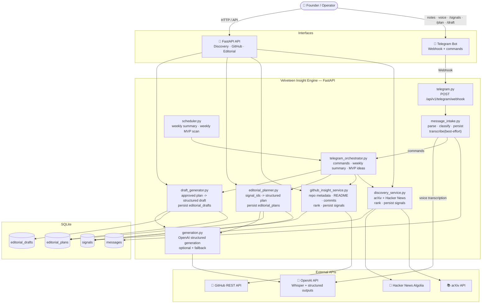

# Velveteen Insight Engine

Velveteen Insight Engine is the editorial and portfolio system inside **The Velveteen Project**, a founder-led applied decision systems lab.

The goal is not generic content automation. The system is designed to turn signals from papers, news, GitHub repos, voice notes, and technical observations into a sober workflow of:

- discovered signals
- editorial plans
- human approval
- persisted drafts
- portfolio-oriented next actions

## Philosophy

- No hype
- No overengineering
- No empty automation
- Prefer deterministic rules when they are enough
- The LLM does not control system logic
- Clean, typed, maintainable code

## Current Scope

Implemented through the current Telegram-first workflow:

- **Phase 1**: FastAPI app, Telegram webhook, SQLite persistence
- **Phase 2**: Telegram parsing, reply and URL detection, deterministic classifier
- **Phase 3**: Voice note intake, Telegram audio download, non-fatal transcription
- **Phase 4**: External discovery with arXiv and Hacker News, heuristic ranking, signal persistence
- **Phase 5**: GitHub insight service for public repos, heuristic ranking, signal persistence
- **Phase 6**: Structured editorial planning from persisted signals
- **Phase 7**: Editorial plan persistence plus human approval workflow
- **Phase 8**: Draft generation from approved plans, with persisted drafts
- **Phase 9**: Telegram command layer and local scheduler for weekly discovery/orchestration
- **Current loop**: Telegram can now trigger plan creation, plan approval, draft generation, and compact plan/draft inspection

## System Flow



## What The System Does Today

The engine can currently:

- ingest Telegram text and voice inputs
- persist normalized messages in SQLite
- discover external signals from arXiv and Hacker News
- inspect public GitHub repos for portfolio-relevant signals
- persist all discovered signals in `signals`
- generate structured editorial plans from one to three persisted signals
- persist editorial plans in `editorial_plans`
- move plans through a small human-review workflow
- generate structured drafts only from approved plans
- persist editorial drafts in `editorial_drafts`
- respond to Telegram commands for discovery, planning, approval, and draft inspection
- run a small local scheduler for weekly summary and MVP scan jobs

It does **not** yet publish to LinkedIn, sync to a website, or automate final approval decisions.

## Telegram Workflow

The core working loop now supported in chat is:

1. Discover or inspect signals:
   - `/papers <topic>`
   - `/news <topic>`
   - `/signals <topic>`
   - `/github_insights`
   - `/weekly`
   - `/mvp_ideas <topic>`
2. Turn one persisted signal into a plan:
   - `/plan <signal_id>`
3. Review plan state:
   - `/show_plan <plan_id>`
4. Approve or discard:
   - `/approve <plan_id>`
   - `/discard_plan <plan_id>`
5. Generate a draft from an approved plan:
   - `/draft <plan_id>`
6. Inspect the draft:
   - `/show_draft <draft_id>`

The command layer is intentionally compact. It reuses the persisted workflow instead of bypassing it.

## Data Model

- `messages`
  - normalized Telegram intake events
- `signals`
  - external and internal signals from discovery and GitHub inspection
- `editorial_plans`
  - persisted structured editorial proposals
  - statuses:
    - `draft`
    - `approved`
    - `saved`
    - `discarded`
- `editorial_drafts`
  - persisted drafts generated only from approved plans
  - statuses:
    - `draft`
    - `discarded`

## Main API Endpoints

### Health

- `GET /api/v1/health`

### Telegram

- `POST /api/v1/telegram/webhook`

### Discovery

- `GET /api/v1/discovery/suggest`

This endpoint is stateful: it discovers, ranks, persists returned signals, and then responds.

### GitHub Insights

- `GET /api/v1/github/insights/suggest`

This endpoint is also stateful: it suggests repo insights and persists them to `signals`.

### Editorial Planning

- `POST /api/v1/editorial/plan`
- `GET /api/v1/editorial/plans/{id}`
- `POST /api/v1/editorial/plans/{id}/approve`
- `POST /api/v1/editorial/plans/{id}/save`
- `POST /api/v1/editorial/plans/{id}/discard`

Plan transitions:

- `draft -> approved | saved | discarded`
- `approved -> saved`
- `saved` is terminal
- `discarded` is terminal

### Editorial Drafts

- `POST /api/v1/editorial/plans/{id}/draft`
- `GET /api/v1/editorial/drafts/{id}`
- `POST /api/v1/editorial/drafts/{id}/discard`

Draft creation is conservative:

- it only works from an `approved` plan
- it does not allow multiple drafts per plan yet
- it falls back to the same structured shape if LLM generation is unavailable

## Tech Stack

- Python 3.11+
- FastAPI
- Pydantic
- httpx
- SQLite
- OpenAI API
- pytest
- ruff
- mypy
- uv

## Project Structure

```text
app/
├── api/routes/        # FastAPI endpoints
├── core/              # Settings and shared config
├── db/                # SQLite setup and queries
├── domain/            # Internal domain models
├── integrations/      # Telegram, GitHub, arXiv, HN, OpenAI clients
├── prompts/           # Minimal prompt layer for structured generation
├── schemas/           # Pydantic request/response contracts
├── services/          # Discovery, GitHub insights, editorial planning, drafts, orchestration
└── utils/

tests/                 # Unit and integration-style tests with mocked network
scripts/               # DB setup and webhook helper scripts
```

## Local Setup

### 1. Install dependencies

```bash
make install
```

### 2. Configure environment

```bash
cp .env.example .env
```

Review at least:

- `TELEGRAM_BOT_TOKEN`
- `TELEGRAM_WEBHOOK_SECRET`
- `OPENAI_API_KEY` if you want real transcription or structured generation
- `GITHUB_TOKEN` if you want higher GitHub API limits
- `ENABLE_SCHEDULER`
- `TELEGRAM_ADMIN_CHAT_ID`

### 3. Initialize the database

```bash
make setup-db
```

### 4. Run the API locally

```bash
make dev
```

The app will be available at [http://localhost:8000](http://localhost:8000).

## Quality Checks

```bash
make test
make lint
make typecheck
```

## Demo Path

A small end-to-end demo now looks like this:

1. Send `/signals climate risk` in Telegram.
2. Pick one returned signal id.
3. Send `/plan <signal_id>`.
4. Review with `/show_plan <plan_id>`.
5. Approve with `/approve <plan_id>`.
6. Generate a draft with `/draft <plan_id>`.
7. Inspect with `/show_draft <draft_id>`.

That already demonstrates the main product loop:

`Telegram command -> signals -> plan -> approve -> draft`

## Status

The project is intentionally still small and API-first. The emphasis so far is:

- deterministic logic first
- good separation of concerns
- non-fragile integrations
- auditable editorial decisions
- a usable Telegram-first operating loop

Later phases can build on this base for exports, publication tooling, and richer approval UX without forcing the LLM to own the system.
