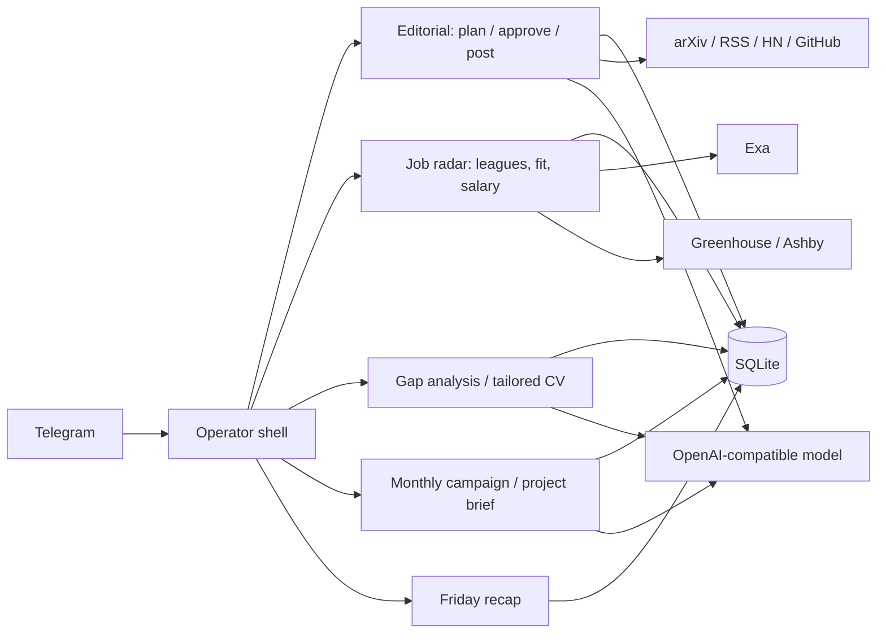

# Velveteen Insight Engine

A Telegram operator that manages one person's job search and public voice.
It is the operating layer of **The Velveteen Project**, a founder-led
applied decision systems lab, and it exists to move Carlos toward a concrete
goal: a research or scientific-ML role, with LinkedIn as the visibility
channel and a monthly campaign toward the roles he wants most.

It is not a content bot and not a job board scraper. It is a persisted
workflow with a deterministic core, where language models only transform
structured inputs into structured outputs and never own the logic.

`signal -> plan -> approval -> post -> published` on the editorial side,
`radar -> fit -> gap -> tailored CV -> application -> Friday recap` on the
career side, and a monthly campaign that connects the two: the gap for an
ambitious role becomes builds and posts, and the application arrives with
new evidence.

## What it does

| Loop | What happens | Commands |
|---|---|---|
| Discovery | arXiv, Exa neural search, RSS blogs (Google Research, OpenAI News), Hacker News, priority GitHub repos; deterministic ranking with an honest per-source footer | `signals`, `papers`, `news`, `github_insights`, `weekly` |
| Editorial | signal to persisted plan, human approval, structured draft, optional MVP handoff pack | `plan`, `apruébalo`, `draft`, `mvp_handoff` |
| LinkedIn | paste-ready posts in English, written from Carlos's perspective with his own published posts as voice exemplars; optional founder opinion as the primary input | `linkedin`, `opinion`, `linkedin_prompt` |
| Tuesday column / Thursday finding | three candidates from blogs (Tuesday) or papers (Thursday) and a one-line command that turns one into a post with his opinion | `columna`, `columna 1: mi opinión`, `hallazgo` |
| Post ledger | every generated post recorded; published ones marked with URL; weekly cadence target with quiet reminders | `publicado <url>`, `posts` |
| Job radar | two leagues: general boards via Exa (realistic) and direct Greenhouse/Ashby boards of target companies (ambitious); deterministic fit score with a readable note; salary, country and requirements extracted from the posting | `jobs`, `jobs realista`, `jobs ambicioso`, `vacante <id>`, `pipeline [liga]` |
| Applications | pipeline moved by hand | `aplicado <id>`, `estado <id> entrevista\|oferta\|rechazado\|guardado\|descartado` |
| Gap and CV | master CV compared with one posting: covered, missing, what to foreground, honest verdict, application opener; one-page tailored CV as Markdown and .docx | `brecha <id>`, `cv <id>`, `cv_master` |
| Monthly campaign | one ambitious lead turned into a four-week plan of builds and posts, each naming the gap it closes; project brief for Claude per build item | `objetivo <id>`, `objetivo`, `hecho <n> <url>`, `proyecto <n>`, `abandonar objetivo` |
| Friday recap | posts, applications, radar counts, campaign progress, repo commits, and a deterministic verdict out of 3 with the reasons spelled out | `recap` |
| Operations | self-diagnosis without echoing keys; resets that keep the goal and the master CV | `diag`, `reset_editorial`, `reset_vacantes`, `reset_todo` |

Natural language works for most of it: "hazme un plan del primero",
"apruébalo", "ya lo publiqué https://…", "apliqué a 3", "me siento realista",
"cómo fue la semana".

## Schedules

All production jobs run from GitHub Actions and call authenticated internal
routes; the app itself keeps no scheduler in production.

| When (UTC) | Job | Route |
|---|---|---|
| Sunday 09:00 | weekly editorial synthesis | `/api/v1/internal/run-weekly-summary` |
| Monday 12:00 | job radar, both leagues; sends only when something is new | `/api/v1/internal/run-job-radar` |
| Tuesday 12:00 | column candidates from blogs and news | `/api/v1/internal/run-post-proposal?slot=columna` |
| Tuesday, Thursday 13:00 | cadence reminder, only when the weekly target is unmet | `/api/v1/internal/run-cadence-check` |
| Thursday 09:00 | MVP scan | `/api/v1/internal/run-mvp-scan` |
| Thursday 12:00 | finding candidates from papers | `/api/v1/internal/run-post-proposal?slot=hallazgo` |
| Friday 21:00 | Friday recap | `/api/v1/internal/run-friday-recap` |
| Daily 10:00 | handoff follow-ups | `/api/v1/internal/process-handoff-followups` |

## Architecture

- `app/api/routes/` FastAPI endpoints: Telegram webhook, health, internal cron routes, discovery and editorial APIs
- `app/services/telegram_orchestrator.py` the operator shell: command parsing, natural-language routing, persisted chat state, dispatch
- `app/services/` one module per capability: `discovery_service`, `editorial_planner`, `draft_generator`, `linkedin_writer`, `post_ledger`, `job_radar`, `cv_tailor`, `cv_docx`, `campaign`, `friday_recap`, `diagnostics`
- `app/integrations/` I/O only: Telegram, arXiv, Hacker News, Exa, RSS, GitHub, Greenhouse and Ashby boards, OpenAI-compatible client
- `app/prompts/` every prompt in one place; `app/context/` static brand context and the LinkedIn voice exemplars
- `app/schemas/` Pydantic contracts, including the structured outputs every model call must fit
- `app/db/` SQLite with explicit SQL and idempotent migrations

Rules that hold everywhere: ranking, routing, state and verdicts are
deterministic; every model call returns a validated Pydantic object or
falls back honestly; every Telegram message is valid HTML and never
truncated with an ellipsis; nothing personal (master CV, keys) lives in the
repo.


```mermaid
flowchart LR
    TG["Telegram"] --> OP["Operator shell"]
    OP --> ED["Editorial: plan / approve / post"]
    OP --> JR["Job radar: leagues, fit, salary"]
    OP --> CV["Gap analysis / tailored CV"]
    OP --> CP["Monthly campaign / project brief"]
    OP --> RC["Friday recap"]
    ED --> DB[("SQLite")]
    JR --> DB
    CV --> DB
    CP --> DB
    RC --> DB
    JR --> EXA["Exa"]
    JR --> BOARDS["Greenhouse / Ashby"]
    ED --> SRC["arXiv / RSS / HN / GitHub"]
    ED --> LLM["OpenAI-compatible model"]
    CV --> LLM
    CP --> LLM
```

## Configuration

Copy `.env.example` to `.env`. The variables that matter:

- `TELEGRAM_BOT_TOKEN`, `TELEGRAM_WEBHOOK_SECRET`, `TELEGRAM_ADMIN_CHAT_ID`
- `OPENAI_API_KEY`, `EDITORIAL_MODEL` (gpt-5.x supported; reasoning models get token headroom automatically), `UTILITY_MODEL` for cheap extraction, optional `OPENAI_BASE_URL`
- `EXA_API_KEY` for neural search and posting text
- `DISCOVERY_ENABLED_SOURCES`, `DISCOVERY_RSS_FEEDS`
- `JOB_RADAR_QUERIES`, `JOB_RADAR_DOMAINS`, `JOB_TARGET_COMPANIES`, `JOB_BOARD_SOURCES`, `TARGET_SALARY_USD_YEAR`
- `LINKEDIN_LANGUAGE` (default `en`), `POST_CADENCE_PER_WEEK`
- `ACTIVE_GOAL_TEXT` one-shot seed; afterwards `/goal "…" --by YYYY-MM-DD`
- `INTERNAL_CRON_SECRET` shared with the GitHub Actions secrets `APP_URL` and `INTERNAL_CRON_SECRET`

The master CV is never a repo file: send it to the bot as a `.md` document
with the caption `cv_master` and it is stored in the database.

## Running it

```bash
make install
make setup-db
make dev
```

Quality gates, all required before a push:

```bash
make test
make lint
make typecheck
```

Deployment is a root `Dockerfile` on Railway with a mounted volume for
SQLite (`DB_PATH=/data/engine.db`). `GET /api/v1/health` reports the
deployed commit, the model and the enabled sources, so a deploy can be
verified from outside.

## Status

Built and in production as of September 2026: discovery, editorial loop,
LinkedIn writing with voice exemplars, post ledger and cadence, two-league
job radar with posting extraction, gap analysis and tailored CVs, monthly
campaign with project briefs, Friday recap, Tuesday and Thursday proposals.

Deliberately out of scope: publishing to LinkedIn through its API,
multi-user support, and any model call that decides instead of transforms.
